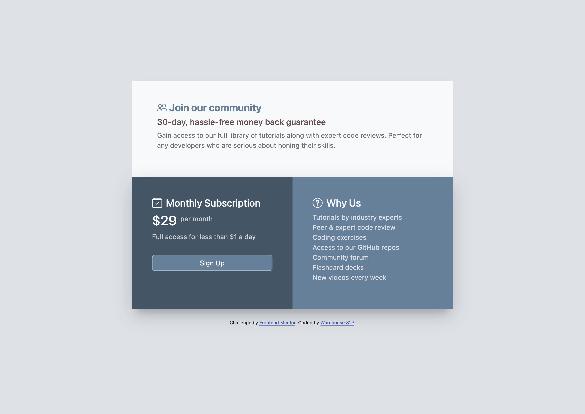

### Screenshot

# Frontend Mentor - Single Price Grid Component

This is a solution to the [Single price grid component challenge on Frontend Mentor](https://www.frontendmentor.io/challenges/single-price-grid-component-5ce41129d0ff452fec5abbbc). Frontend Mentor challenges help you improve your coding skills by building realistic projects.

## Table of contents

- [Overview](#overview)
  - [The challenge](#the-challenge)
  - [Screenshot](#screenshot)
  - [Links](#links)
- [My process](#my-process)
  - [Built with](#built-with)
  - [Useful resources](#useful-resources)
- [Author](#author)

## Overview

### The challenge

Users should be able to:

- View the optimal layout for the site depending on their device's screen size

### Links

- Solution URL: [https://github.com/warehouse827/single-price-grid-component.git]
- Live Site URL: [https://warehouse827.github.io/single-price-grid-component/]

## My process

### Built with

- CSS custom properties
- Flexbox
- Mobile-first workflow
- Bootstrap 5.2 [https://blog.getbootstrap.com/2022/07/19/bootstrap-5-2-0/]

### Useful resources

- [MDN](https://developer.mozilla.org/en-US/)
- [Bootstrap Docs](https://getbootstrap.com/docs/5.2/getting-started/introduction/)

## Author

- Website - [https://warehouse827.com](https://warehouse827.com)
- Frontend Mentor - [@warehouse827](https://www.frontendmentor.io/profile/warehouse827)

